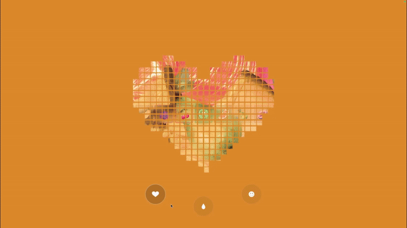

# Video Projection - Codrops


### What you’ll build
An interactive Video Projection composition with grids of cubes with a mask image that decides which cubes appear. A video texture is UV-mapped so each cube shows the exact video fragment that corresponds to its grid cell—together they reconstruct the video, but only where the mask is dark. 



[Read the tutorial](https://tympanus.net/codrops/?p=98461)

[View the demo](https://6ycrps.csb.app/)


### Installing:
```bash
npm install
```
### Usage:
```bash
npm run dev
```
### Deploying:
```bash
npm run build
```

### Colors:
  
  
  
